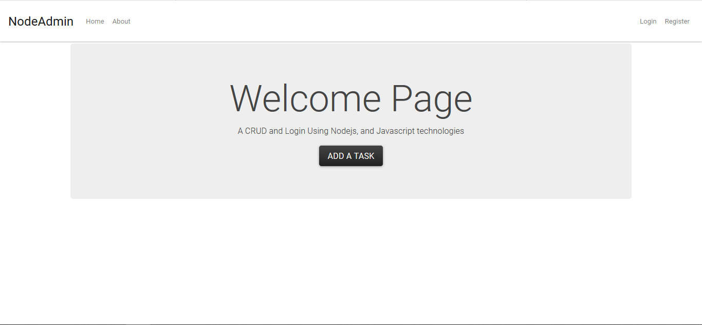
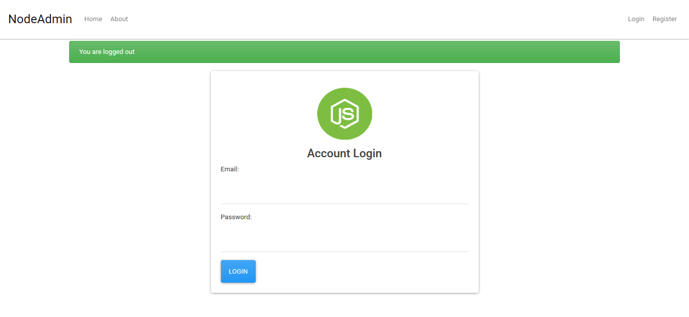
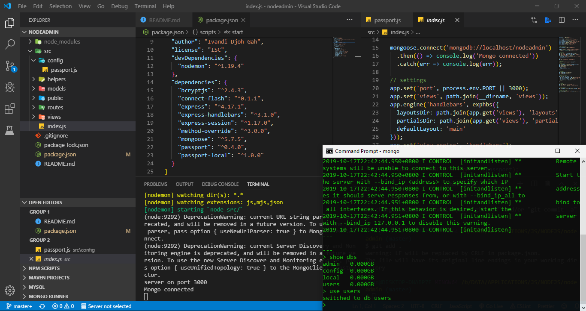

## NodeAdmin

### About NodeAdmin

NodeAdmin is a simple webadmin project, but in here you can learn how to develop application using nodejs & mongodb

### Quick Start

If you're interest with this application feel free to clone by using this url

    https://github.com/ivandi1980/nodeAdmin.git

### Install dependencies
    npm install

### Start Development Server: http://localhost:3000
    npm start

### ScreenShoot

